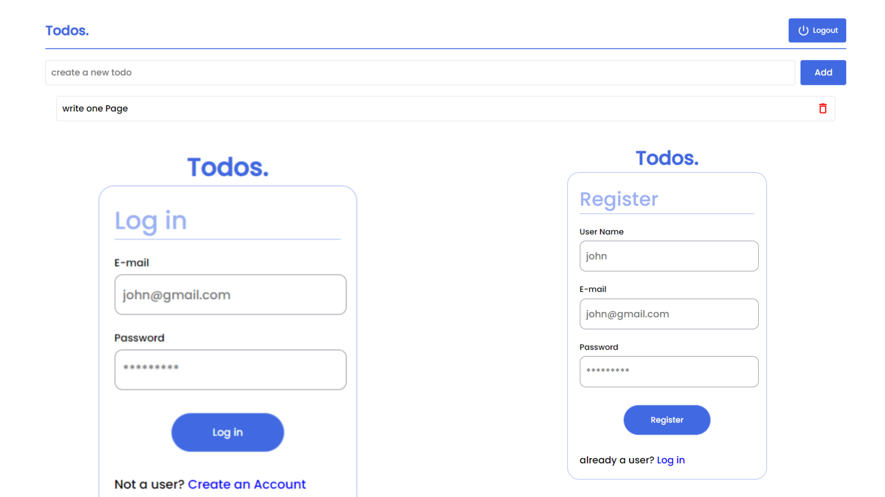

# Todos.



## Description

Full Stack Todos Web App built with MERN STACK

## Tech Stack

**Client:** React JS

**Server:** Node JS, Express JS

**Database:** Mongo DB

## Demo

[https://todos-zgsr.onrender.com//](https://todos-zgsr.onrender.com/)

## Features

- **Authentication**: Users can sign up and log in securely to access their todo lists.
- **Create Todo**: Users can add new tasks to their todo list with titles.
- **View Todo**: Users can see their existing todo list with all the tasks they have added.
- **Delete Todo**: Users can remove tasks from their todo list when they are completed or no longer needed.
- **Logout**: Users can logout when they want to close app.

## Installation

To run this project locally, follow these steps:

1. Clone the repository:

```bash
  git clone https://github.com/Yuvrajshankar/Todos.git
```

2. Go to the project directory

```bash
  cd Todos
```

3. Install dependencies

```bash
  npm install
```

```bash
  cd frontend/
  npm install
```

5. add **".env"** in root folder

```bash
PORT = 3050
JWT_SECRET = "YOUR SECRET KEY"
MONGO_URI = "YOUR MONGO URL"
NODE_ENV = ""
```

4. Start the server

```bash
  npm run server
```

5. Start the Client

```bash
  cd frontend
  npm start
```

## Made By

- [@Yuvrajshankar](https://github.com/Yuvrajshankar)

## License

This project is licensed under the [Apache License](LICENSE).
